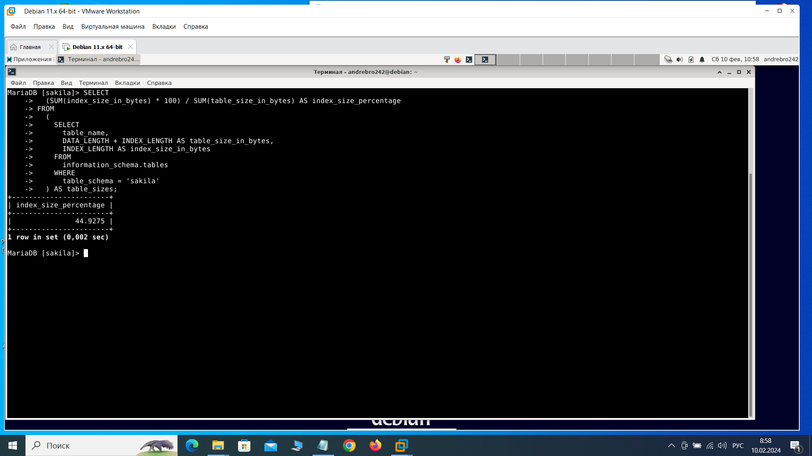
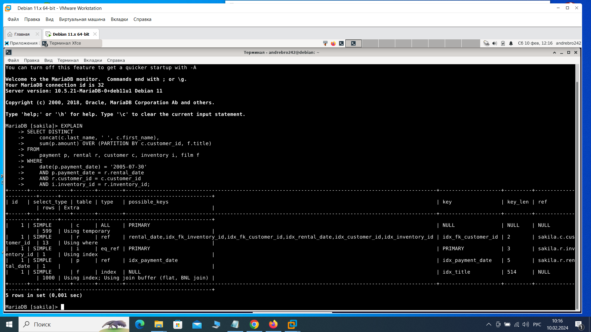
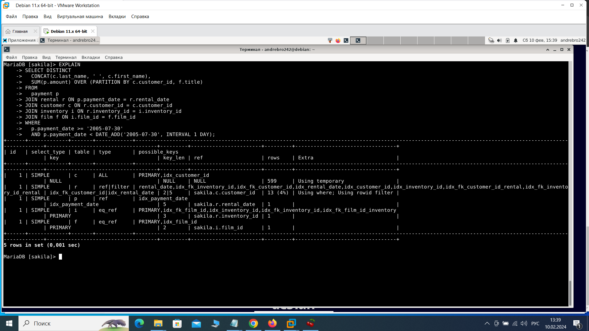

Домашнее задание по лекции "Индексы" Брюхов А SYS-26

Задание 1
Напишите запрос к учебной базе данных, который вернёт процентное отношение общего размера всех индексов к общему размеру всех таблиц.

Решение 1:

1. Расчет процентного отношения размера индексов к размеру таблиц:

    SELECT
      (SUM(index_size_in_bytes) * 100) / SUM(table_size_in_bytes) AS index_size_percentage
    FROM
      (
        SELECT
          table_name,
          DATA_LENGTH + INDEX_LENGTH AS table_size_in_bytes,
          INDEX_LENGTH AS index_size_in_bytes
        FROM
          information_schema.tables
        WHERE
          table_schema = 'sakila' 
      ) AS table_sizes;

Задание 2

Выполните explain analyze следующего запроса:

select distinct concat(c.last_name, ' ', c.first_name), sum(p.amount) over (partition by c.customer_id, f.title)
from payment p, rental r, customer c, inventory i, film f
where date(p.payment_date) = '2005-07-30' and p.payment_date = r.rental_date and r.customer_id = c.customer_id and i.inventory_id = r.inventory_id
перечислите узкие места;
оптимизируйте запрос: внесите корректировки по использованию операторов, при необходимости добавьте индексы.

Решение 2:

    EXPLAIN
    SELECT DISTINCT
        concat(c.last_name, ' ', c.first_name),
        sum(p.amount) OVER (PARTITION BY c.customer_id, f.title)
    FROM
        payment p, rental r, customer c, inventory i, film f
    WHERE
        date(p.payment_date) = '2005-07-30'
        AND p.payment_date = r.rental_date
        AND r.customer_id = c.customer_id
        AND i.inventory_id = r.inventory_id;

Узкие места в запросе:

1. Использование оконной функции с агрегатной функцией в SELECT DISTINCT: Функция SUM() OVER() не может использоваться сразу с DISTINCT в одном запросе. Это может вызвать ошибку >

2.Отсутствие явного объявления использования объединения в запросе: В текущем запросе используются таблицы payment, rental, customer, inventory и film, но не указаны явные объеди>

3.Использование функции DATE() на столбцах, которые могут использовать индексы: Использование функции DATE() в условиях по столбцам, которые могли бы использовать индексы (наприм>

4.Множественное объединение таблиц без явных условий соединения: В запросе множество таблиц объединяются, но без явных условий соединения. Это может привести к выдаче неверных ре>

Оптимизация запроса:

Использую JOIN для улучшения читаемости и оптимизации запроса.

Добавдяю необходимые индексы для ускорения выполнения запроса.

    EXPLAIN
    SELECT DISTINCT
      CONCAT(c.last_name, ' ', c.first_name),
      SUM(p.amount) OVER (PARTITION BY c.customer_id, f.title)
    FROM
      payment p
    JOIN rental r ON p.payment_date = r.rental_date
    JOIN customer c ON r.customer_id = c.customer_id
    JOIN inventory i ON r.inventory_id = i.inventory_id
    JOIN film f ON i.film_id = f.film_id
    WHERE
      p.payment_date >= '2005-07-30'
      AND p.payment_date < DATE_ADD('2005-07-30', INTERVAL 1 DAY);

Оптимизированный запрос использует явные операторы JOIN, это улучшает читаемость и производительность.

Задание 3:

В PostgreSQL существует несколько типов индексов, которые могут использоваться для оптимизации запросов. Некоторые из них, которые доступны в PostgreSQL, но не существуют в MySQL:

GIN (Generalized Inverted Index): Позволяет индексировать сложные типы данных, такие как массивы и JSON.

GiST (Generalized Search Tree): Предоставляет общую структуру для индексации различных типов данных.

BRIN (Block Range INdex): Работает для упорядоченных данных с низкой кардинальностью.

SP-GiST (Space-Partitioned Generalized Search Tree): Используется для индексации пространственных данных.

Hash Index: В PostgreSQL может использоваться для индексации по хэш-функции.

Эти типы индексов предоставляют различные методы оптимизации для разнообразных сценариев использования. MySQL, с другой стороны, имеет свои уникальные типы индексов, но некоторые>

